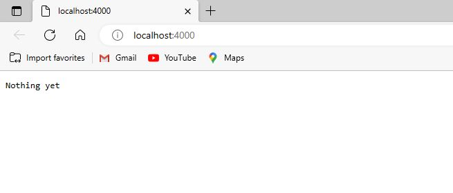
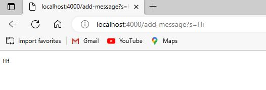
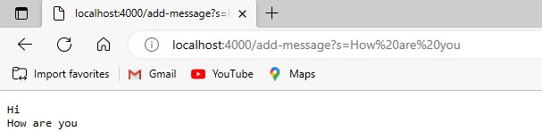

# Lab Report 2
## StringServer
* Below is my code for StringServer:
```
import java.io.IOException;
import java.net.URI;

class Handler implements URLHandler {
    private String message = "";
    public String handleRequest(URI url) {
        if (url.getPath().contains("/add-message")) {
            String[] parameters = url.getQuery().split("=");
            if (parameters[0].equals("s")) {
                String s = parameters[1];
                message += s+"\n";
                return message;
            }
        }
        return "Nothing yet";
    }
}

class StringServer {
    public static void main(String[] args) throws IOException {
        if(args.length == 0){
            System.out.println("Missing port number! Try any number between 1024 to 49151");
            return;
        }

        int port = Integer.parseInt(args[0]);

        Server.start(port, new Handler());
    }
}
```
* Compile and run the code using the following commands:
```
$ javac StringServer.java Server.java
$ java StringServer 4000
```
* A successful run would return a message to your terminal: `Server Started! Visit http://localhost:4000 to visit.`
* Click on the link and the website will look like this:
* Here the method handleRequest from class Handler is being called.
* The code first create a string variable called **message** and initialize it to be an empty string
* Then runs the if statement looking for ```/add-message``` in the path
* Since there is no ```/add-message``` in the path of the url, the code will return ```Nothing yet```, and the webpage will show ```Nothing yet```
* Now let's trying using ```/add-message```
* Trying using ```/add-message?s=Hi```: 
* The page shows ```Hi``` as shown
* Here the method handleRequest from class Handler is being called.
* Since there is ```/add-message``` in the path, the query of the url will be split by ```=``` and stored in the string array called **parameters**
* Then the code will check if the 0th index of **parameters** is ```s```, and since ```parameters[0]``` is indeed ```s``` the code will set the string variable **s** to be ```parameters[1]```
* Then the code will add the string variable **s** and ```"\n"```(this will start a next line) to the variable **message** that was initialized earlier, and the code will return **message**
* Now let's tyring adding a new message using ```/add-message?s=How are you```: 
* Now **parameters** should be set to {"s", "How are you"}, and **s** will be set to "How are you"
* The code will add **s** to **message** which includes the previous strings, and the code then returns **message**, this will have the page show:
```
Hi
How are you
```
## Bugs and JUnit testing 
* The method 
