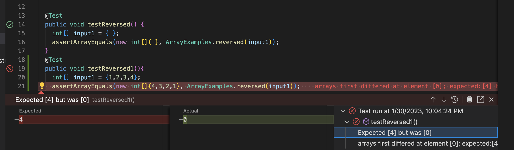

# Lab Report 2
## StringServer
* Below is my code for StringServer:
```
import java.io.IOException;
import java.net.URI;

class Handler implements URLHandler {
    private String message = "";
    public String handleRequest(URI url) {
        if (url.getPath().contains("/add-message")) {
            String[] parameters = url.getQuery().split("=");
            if (parameters[0].equals("s")) {
                String s = parameters[1];
                message += s+"\n";
                return message;
            }
        }
        return "Nothing yet";
    }
}

class StringServer {
    public static void main(String[] args) throws IOException {
        if(args.length == 0){
            System.out.println("Missing port number! Try any number between 1024 to 49151");
            return;
        }

        int port = Integer.parseInt(args[0]);

        Server.start(port, new Handler());
    }
}
```
* Compile and run the code using the following commands:
```
$ javac StringServer.java Server.java
$ java StringServer 4000
```
* A successful run would return a message to your terminal: `Server Started! Visit http://localhost:4000 to visit.`
* Click on the link and the website will look like this:
* Here the method handleRequest from class Handler is being called.
* The code first create a string variable called **message** and initialize it to be an empty string
* Then runs the if statement looking for ```/add-message``` in the path
* Since there is no ```/add-message``` in the path of the url, the code will return ```Nothing yet```, and the webpage will show ```Nothing yet```
* Now let's trying using ```/add-message```
* Trying using ```/add-message?s=Hi```: 
* The page shows ```Hi``` as shown
* Here the method handleRequest from class Handler is being called.
* Since there is ```/add-message``` in the path, the query of the url will be split by ```=``` and stored in the string array called **parameters**
* Then the code will check if the 0th index of **parameters** is ```s```, and since ```parameters[0]``` is indeed ```s``` the code will set the string variable **s** to ```parameters[1]```
* Then the code will add the string variable **s** and ```"\n"```(this will start a next line) to the variable **message** that was initialized earlier, and the code will return **message**
* Now let's tyring adding a new message using ```/add-message?s=How are you```: 
* Now **parameters** should be set to {"s", "How are you"}, and **s** will be set to "How are you"
* The code will add **s** to **message** which includes the previous strings, and the code then returns **message**, this will have the page show:
```
Hi
How are you
```
## Bugs and JUnit testing 
* The bug I chose to analyze from Lab3 is the bugs associated with the method ```reversed```
* A failure inducing input for the program:
```
@Test
  public void testReversed1(){
    int[] input1 = {1,2,3,4};
    assertArrayEquals(new int[]{4,3,2,1}, ArrayExamples.reversed(input1));
  }

```
* An input that doesn't induce a failure for the program:
```
 @Test
  public void testReversed() {
    int[] input1 = { };
    assertArrayEquals(new int[]{ }, ArrayExamples.reversed(input1));
  }
```
* Here are the Junit run results: 
* The symptom of the failed test is that the array returned is not the same as expected
* Here is how I fixed the bugs:
Before:
```
static int[] reversed(int[] arr) {
  int[] newArray = new int[arr.length];
  for(int i = 0; i < arr.length; i += 1) {
    arr[i] = newArray[arr.length - i - 1];
  }
  return arr;
}
```
After:
```
static int[] reversed(int[] arr) {
    int[] newArray = new int[arr.length];
    for(int i = arr.length - 1, j = 0; i >= 0; i --) {
      newArray[j] = arr[i];
      j++;
    }
    return newArray;
  }
```
* The bug in the original code is that it is setting the values in **arr** to the values in **newArray** which is filled with 0s.
* I fixed it by looping through **arr** reversly and set the values in **newArray** to the values in **arr** reversly.
## What I learned from week 2&3 labs
* I learned about what to look for during debugging. Debugging used to be really hard and time consuming for me since I didn't know how to debug correctly. I learned the correct steps for debugging process during week 3, and this has helped me a lot in my other programming classes. JUnit tests also really helped me to save a lot of time.
